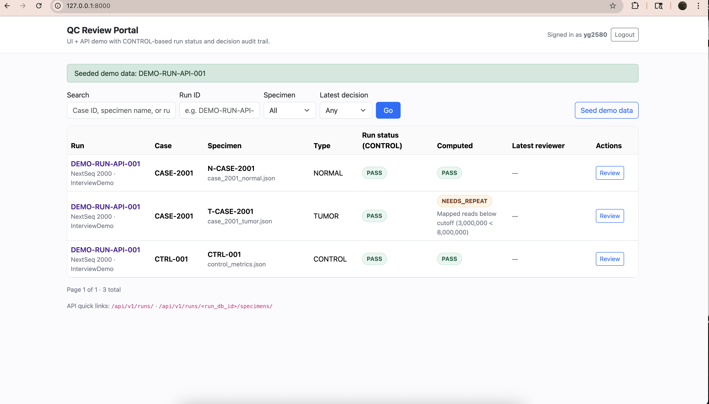
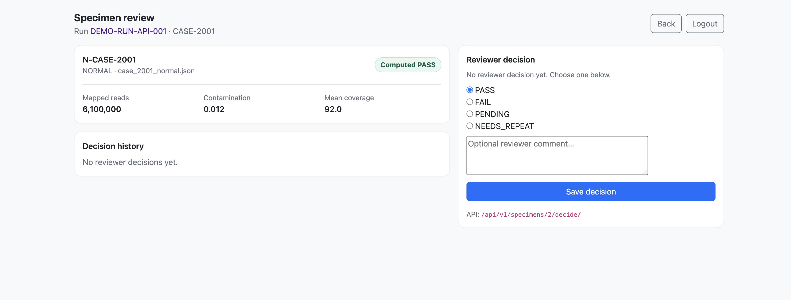

# QC Review Portal (Demo)

A **Django-based QC Review Portal** built as a **personal demo project** to showcase backend architecture, API design, and UI integration using a realistic clinical QC workflow.

The functionality is inspired by a production **QC Checker** system, but the codebase, structure, and naming are intentionally redesigned for demonstration and interview use.

---

## Purpose

This project demonstrates:

- Clean Django project structure  
- Clear separation of concerns (rules, services, views, APIs)  
- Practical database modeling with external database support  
- REST APIs and HTML UI sharing the same business logic  
- Realistic QC decision logic with full audit trails  
- Readable, maintainable, human-written code  

All data is **synthetic** and contains **no patient information**.

---

## Core Features

### QC Metric Evaluation
- Stores specimen-level QC metrics (reads, contamination, coverage)
- Supports **NORMAL**, **TUMOR**, and **CONTROL** specimen types
- Automated rule-based QC decisions:
  - **PASS**
  - **FAIL**
  - **NEEDS_REPEAT**
  - **PENDING**

---

### Run-Level QC Status (CONTROL-based)
- Run status is derived **only from CONTROL specimens**
  - All controls **PASS** → Run **PASS**
  - Any control **FAIL** → Run **FAIL**
  - No control present → Run **PENDING**

---

### Reviewer Decision Workflow
- Reviewers can override automated decisions
- Each decision records:
  - Decision value
  - Reviewer
  - Timestamp
  - Optional comment
- Full decision history is preserved for auditing

---

### Web UI
- Dashboard with filtering and pagination
- Run detail view showing all specimens in a run
- Specimen review page with:
  - Computed QC result
  - Metric breakdown
  - Reviewer decision form
  - Decision history

---

### REST API
- List sequencing runs
- Retrieve run specimens and run QC status
- Retrieve specimen-level QC details
- Submit reviewer decisions programmatically

The UI and API share the same underlying business logic.

---

## Relationship to the Production QC Checker

### Intentionally the Same
- QC decision logic and workflow concepts  
- CONTROL-based run status computation  
- Automated and manual review flow  
- Decision audit trail  
- Combined UI and API access patterns  

### Intentionally Different
- Simplified schema and QC thresholds  
- Synthetic demo data only  
- Renamed models and modules  
- No production integrations (LIMS, pipelines, file watchers)  
- No PHI or clinical identifiers  

These differences ensure the repository is **safe, portable, and interview-appropriate**.

---

## Tech Stack

- Python  
- Django  
- Django REST Framework  
- External database via `DATABASE_URL` (PostgreSQL / MySQL compatible)  
- HTML templates with Bootstrap  
- Session-based authentication  

---

## Dashboard

## Specimen Review

